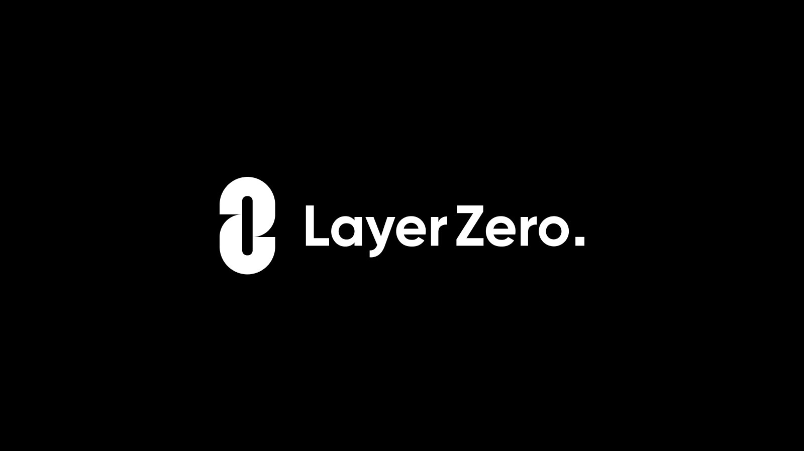

<div align="center">
    
</div>

---

## Prepare ProgramId

create programId keypair files if not existed

```

cd packages/solana
solana-keygen new -o target/deploy/omnicounter-keypair.json
solana-keygen pubkey target/deploy/omnicounter-keypair.json
```

Globally search for `2tLJfE12h5RY7vJqK6i41taeg8ejzigoFXduBanDV4Cu` in the project and replace it with your own program ID.

## Build

```bash
yarn && yarn build
```

## Deploy & Configure

1. Deploy the program to the Solana network

``` bash
cd packages/solana
anchor build
solana program deploy --program-id target/deploy/omnicounter-keypair.json target/deploy/omnicounter.so -u testnet
```

2. Configure the program

``` bash
cd packages/solana-sdk
yarn ts-node scripts/config.ts
```

## How the offchain executor works
When the offchain executor needs to call `lz_receive`, executor will call the `lz_recevive_types` instruction to get the accounts required by the `lz_receive` function. And the accounts required by the `lz_receive_types` instruction can be found from the specified PDA account that is generted by the `[LZ_RECEIVE_TYPES_SEED, oapp's PDA]`.
> The `lz_receive_types` PDA seed must be composed of `[LZ_RECEIVE_TYPES_SEED, oApp's PDA]`, which means this PDA must be registered to endpoint program.

see `packages/solana/programs/counter/src/instructions/init_count.rs` and `packages/solana/programs/counter/src/instructions/lz_receive_types.rs` for more details.

> Note: The struct `LzReceiveParams` and `LzComposeParams` cannot be modified (including the field order)